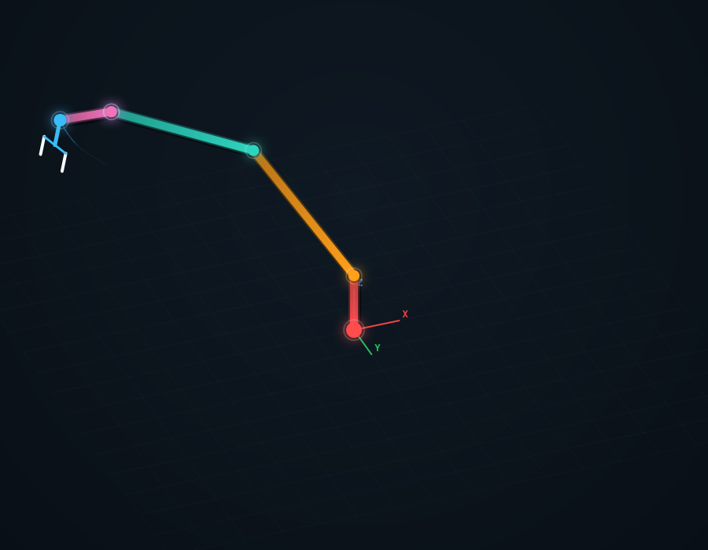
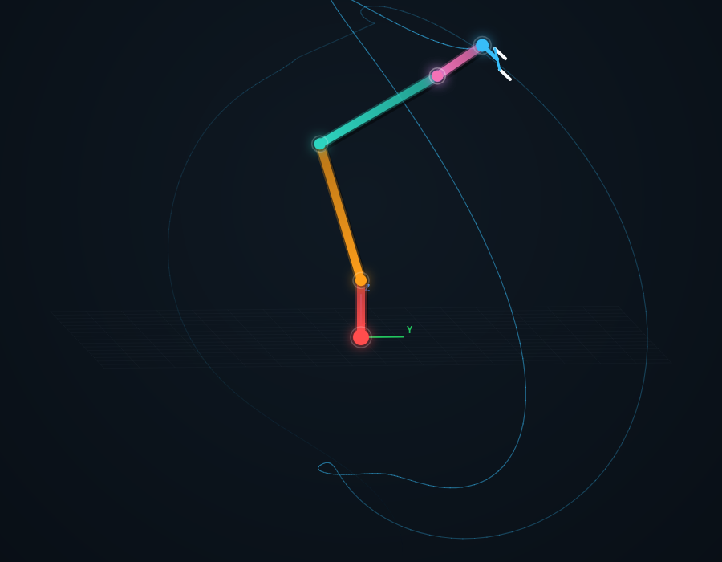

# Kinematic Visualizer for Robotic Manipulators

Interactive forward kinematics visualization tool for serial robotic manipulators using Denavit–Hartenberg (DH) parameters.

## Features

- 2–6 DOF robotic manipulator
- Real-time FK visualization
- Interactive joint control
- Articulated gripper
- End-effector tracking
- Coordinate frame visualization
- Workspace trace rendering
- Camera rotation and zoom
- Dark robotics-style UI

## Tech Stack

- React
- HTML5 Canvas
- JavaScript
- DH Kinematics

## Screenshots

### Main Interface


### End-Effector Trace


## Run Locally

```bash
npm install
npm start
